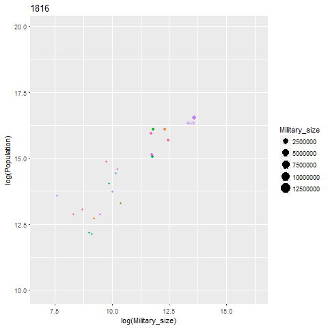

# War and Peace 

[Rahul Oka](http://anthropology.nd.edu/faculty-and-staff/faculty-by-alpha/rahul-oka/), [Agustin Fuentes](http://anthropology.nd.edu/faculty-and-staff/faculty-by-alpha/agustin-fuentes/), [Susan Sheridan](http://anthropology.nd.edu/faculty-and-staff/faculty-by-alpha/susan-sheridan/), [Mark Golitko](http://anthropology.nd.edu/faculty-and-staff/faculty-by-alpha/mark-golitko/), [Nam Kim](https://www.anthropology.wisc.edu/staff/kim-nam-c/), and I recently published a paper in PNAS looking at how demographics affects both the size of a war group and conflict causalities. 

 __Here is the gist__: 

       
Many scholars have noted that in hunter-gather populations, the number of people involved in fighting can be as much as 40% of the population, but this percentage drops in big state-level societies. One of the first people to note this was Larry Keeley in his War Before Civilization, first published in 1994. He noted that the percentage of male war deaths was higher in nonstates than in states. Others, such as Steven Pinker, have taken these data to mean that “civilization” has a pacifying element. As Pinker puts it “violence has declined over long stretches of time, and today we may be living in the most peaceable era in our species’  existence” (Pinker 2011: xxi). Using data from Keeley and other scholars, he concludes that before the emergence of the state, the violent death rate was around 15%.

Raul Oka wondered if this could be due to population size. In other words, is this drop in the number of people involved in war (what we call the “war group”) due to the effects of living in a state or is it a reflection of broader issues that appear when population increases?
We collected data on population and war group size from 295 societies and on war group size and conflict-related casualties from 430 historical conflicts going back to 2500 B.C. We show that, as population goes up, the proportion of people involved in conflict decreases.  In other words, it is not that states prevent violence, but rather that other factors, such as the need to feed, cloth, and arm a war group makes it harder to involve a large percentage of people in more complex societies. 

You can read [the paper here](http://www.pnas.org/content/early/2017/12/07/1713972114.short?rss=1)


And [Science coverage here](http://www.sciencemag.org/news/2017/12/why-human-society-isn-t-more-or-less-violent-past)


For an interactive take at some of these data, the following plot plots war group size as a function of population by year. The size of the circle is scaled to the size of the army.  



```{r}

```


To examine how DCI changes over time, the following graph explores a subset of the data (due to limit in storage space). All these data are available on the PNAS website.


```{r, include=FALSE}
library(tidyverse)
library(ggplot2)
library(plotly)
#setup data
X_factor <- read_csv("X_Factor_Dataset.csv")
X_factor <-  X_factor %>% gather(value = X, key = country, Belgium:Iraq)


p <- ggplot(X_factor, aes( x=Year, y = X, group=country, color = country)) + geom_line() + ylab("DCI")
p <- ggplotly(p)
p

```

```{r,echo=FALSE, out.width=10%,out.height=10%}
p
```


